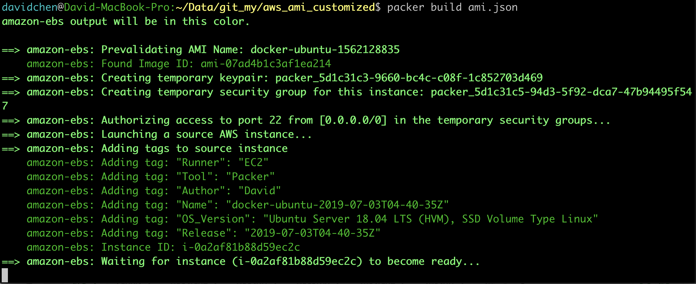
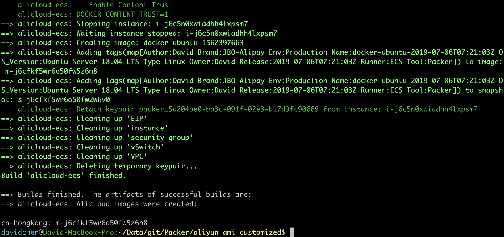

# aws ami customized / aliyun_ami_customized

# Install:

```console
brew install packer
packer version
vim ami.json
```

# Fix Command
```console
packer fix ami_tmp.json > ami.json
Or
packer fix ecs_tmp.json > ecs.json
```

# Validate Command
```console
packer validate ami.json
Or
packer validate ecs.json
```

# Usage:

```console
cd packer
packer build ami.json
packer build ecs.json
```




# Debug: (Debug log output from pakcer command)
```console
PACKER_LOG=1 packer build ami.json
```

* [Amazon AMI Builder](https://www.packer.io/docs/builders/amazon.html)
